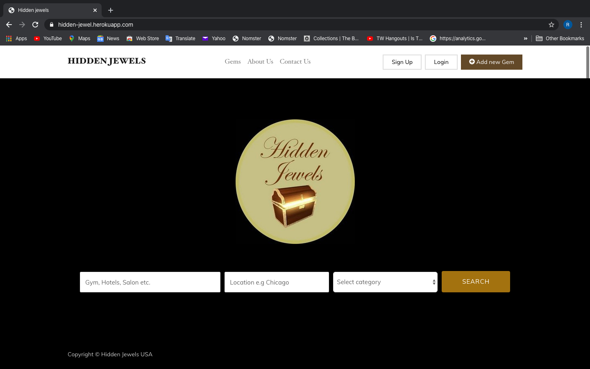

# HIDDEN-JEWELS

A web Application that integrates with Google Maps API and includes features like user comment, image uploading and user authentication. 

  * Built with ruby on rails

  * Bootstrap

  * Ruby version 2.6 with Rails 6

  * Database: Postgresql

  * Admin backend with railsadmin

  This is the homepage:
  
  

  
  
  This is the showpage with embedded youtute videos and google map:
  
  
  

