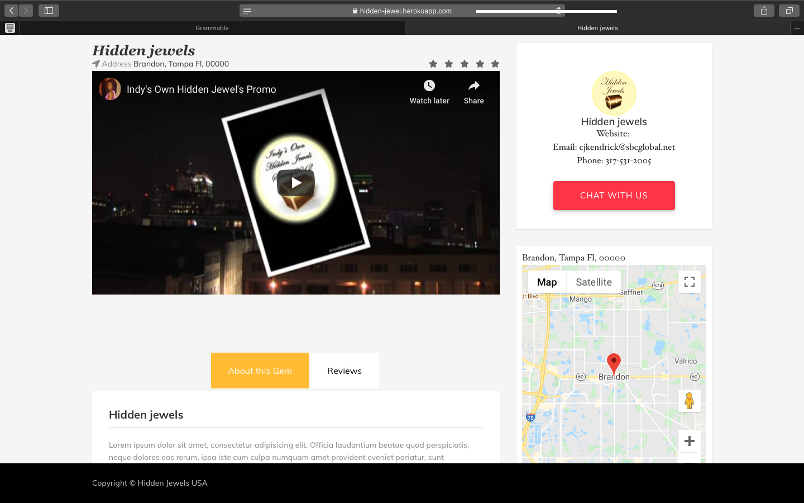

# HIDDEN-JEWELS

A web Application that integrates with Google Maps API and includes features like user comment, image uploading and user authentication. 

  * Built with ruby on rails

  * Bootstrap

  * Ruby version 2.6 with Rails 6

  * Database: Postgresql

  * Admin backend with railsadmin

  

<<<<<<< HEAD
  

=======
>>>>>>> 9d839a19eb0b11715f97864684b81bf5d0b2e94a
